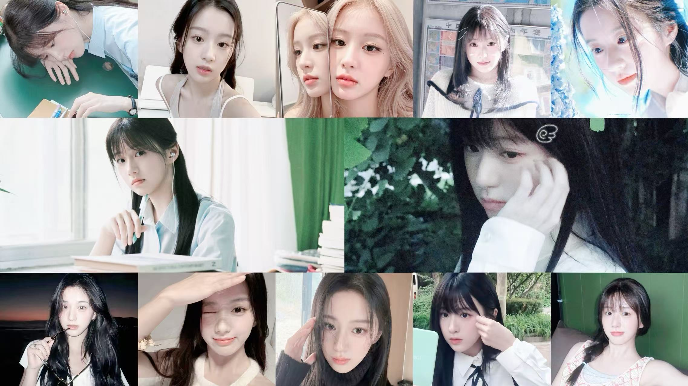
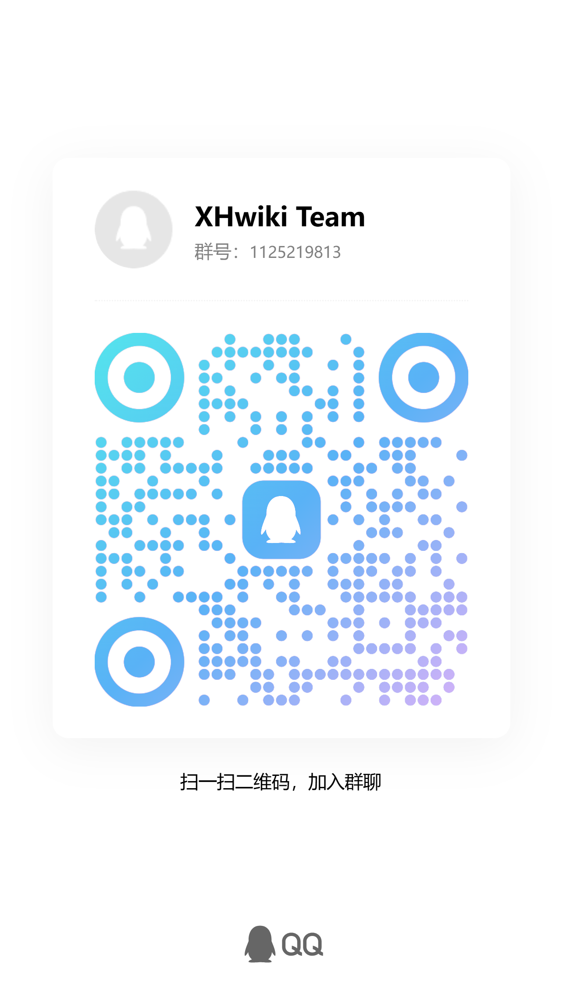

# 欢迎来到星海wiki！

> 她真好看。 ——Luoah

XHwiki，即星海wiki，是由Luoah制作的wiki网站。
这里收录南京郑和外国语学校星海班(即2025级2班)的各种梗知识、人物、
以及各种语录……

**附：即2026.10.1起，XHwiki使用AES针对部分用户加密限制访问，如要使用本网站请联系管理员获取账号（权限依据你使用网站的行为及你的日常人品给予）。因此部分账号对部分页面访问受限（即便你拥有账号，权限依然存在层级）。**

---

## 制作团队

策划：Luoah

设计：Luoah

代码：Luoah

文本：Luoah

美工：Luoah

运营：Luoah

发行：Luoah

宣传：Luoah

**Luoah真是太强了！**

---

## 联系我们

如果您有合理的意见，我们非常欢迎您为我们XHwiki的发展建言献策。

当然，您也可以大胆提出不合理的问题，这样您就可以出现在Luoah的黑名单中名垂浅屎，并且Luoah也不会改。

如果您提出的意见足够有价值、有意义，我们的团队将非常欢迎您的加入！

附：若要联系Luoah，请打开[Luoah](https://luoah-ivy.github.io/XHwiki/Students/25/#_5)的介绍以查看。

注：XHwiki Team QQ群已禁止通过搜索群号添加，如有特别情况，请扫描二维码添加。

---

## 声明

1.我们不反对使用本wiki了解星海班的梗并使用，但我们反对使用这些梗恶意攻击他人。

2.我们仅是对这些梗或人做出说明与解释，没有任何倾向，请勿过度解读。

3.本网站一周至少更新5次，周三统一维护服务器，因此不建议您周中频繁访问，Luoah也是学生，更新较慢见谅。

4.禁止看完梗之后嘲笑同学(尤其是Luoah)，否则Luoah将会使用技术手段，将你的主页换成暗网。

5.禁止看完第4条后故意激怒Luoah，并且说第4条是奖励。

6.禁止问Luoah要暗网网址，Luoah没有。

7.禁止跟Luoah分享暗网网址，Luoah不想看。

---

## 致谢

> 我怀念的 是无话不说
> 
> 我怀念的 是一起做梦
>
> 我怀念的 是无言感动
> 
> 我怀念的 是永远炽热
> 
> ——孙燕姿《我怀念的》

感谢Henson提供部分灵感与思路支持。

感谢Henson、Milson、响彻未来、Goldenfish参与公测并提供意见。

感谢lris在我的创作途中给予我的激励与支持。

感谢Bilibili 8047-的教学。

感谢Github提供的云存储与服务器支持。

感谢mkdocs的wiki模板。

---

## 开源项目 

感谢Github为我们提供的支持，我们制作团队为创造更好的开源环境，公布我们的源码仓库。

> https://github.com/Luoah-ivy/XHwiki/tree/gh-pages

---

## 友情链接

> https://nflsoi.cc:20035/
> 
> https://www.weibo.com/1005055994952329?from=page_100505_profile&wvr=6&mod=data

附：

> .cc结尾的网站都是色情网站。 ——Milson
> 
> 南外信息学网站就是.cc结尾。 ——Luoah

---

## 夹带私货

