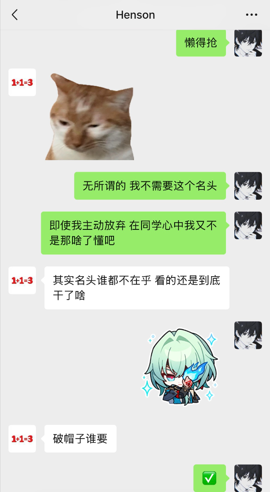

# 金仕杰

> 不是我感觉我怎么是个唐逼啊。 ——金仕杰对这个人物的评价

---

## 简介

金仕杰(20250225)，昵称Luoah小落。

|    别称    |                                                            关联大事件                                                            |
|:--------:|:---------------------------------------------------------------------------------------------------------------------------:|
| 老班、班班、班长 | XHwiki、给你户开了、锅金鱼食乃龙、魔~术~技~巧~、我将 誓死捍卫 我的 刘海、希望有羽毛和翅膀、[5.28世界上会有一个非常非常幸福的女孩](https://luoah-ivy.github.io/XHwiki/Meme/DLL528/) |

### 你知道的太多了

最喜欢的颜色：天蓝

喜欢的歌手：林俊杰、李荣浩、孙燕姿、杨丞琳、郑润泽、颜人中、周杰伦、郭静、Bsh-1

喜欢的专辑：**逆光**、**新地球**、**第Ⅱ天堂**、**另一个童话**、**耳朵**、**黑马**、**Rainie & Love…? 雨爱**、**半熟宣言**、**独立日**、**哎呦，不错哦**

*（Luoah对自己的歌品是非常自信的。）*

最喜欢的一首歌(2026/9/24记)：**我怀念的**-孙燕姿

喜欢的食物：酸汤肥牛、舒芙蕾、**抹茶**的一切(红豆来者不拒)、炸鸡(刚出炉的)

喜欢的游戏：王者荣耀、三角洲行动、无畏契约、原神崩铁绝区零、实况足球

喜欢的演员：**包上恩**

喜欢看的番：冰菓

喜欢的动漫：新海诚灾难三部曲(**你的名字**、**天气之子**、铃芽之旅)、秒速五厘米、言叶之庭

最喜欢的一句歌词：轻弹一首别离 名为**茉莉雨**

未来职业？：老师、程序员、创业？

擅长的学科：无

不擅长的学科：语文、数学、英语、政治、历史、物理、化学、生物、地理、体育、美术、音乐、信息

考试考好的秘诀：0%的努力，0.01%的天赋，99.99%的发挥+运气

考试考差的秘诀：学习金仕杰的学习方法

最喜欢的老师：

Top1-语文**戴丽莉**

Top2-物理吴赵 

Top3-数学汪岚/生物颜承祐/信息殷坤/体育张彪(不知道这四个怎么排，就当并列看吧)

金仕杰有一个亲弟弟，叫做金仡杰。

---

## 班长

因为金仕杰的性格是慢热的，所以刚开学的军训他表现非常好，几乎不怎么讲话，但是这其实只是因为他比较腼腆罢了。
其实也有例外，比如在刚开始排队的时候，看到金泽霖和卢润坤一直在笑，于是大胆挑战跟金泽霖对视五秒，结果没绷住。

正因为在军训时不错的表现，被戴老师选为了初一二班的班长(同时被选上的还有张一格)。
可能由于金仕杰与同学们比较好打交道，渐渐地同学们好像总是叫金仕杰老班或班长。
后来金仕杰当上了中队长。

这种失去本名的现象一直出现到初一下，因为金仕杰已经担任了中队长，所以在经过思考后选择放弃班长的职务(这个其实是有原因的，但是你知道的太多了)。
在金仕杰已经不是班长之后，一些同学好像还是更愿意叫他班长。

---

## 联系方式

- 手机号：15996419387
- 微信：Luoahzzz
- 邮箱：3385531450@qq.com
- GitHub：[@Luoah-ivy](https://github.com/Luoah-ivy)